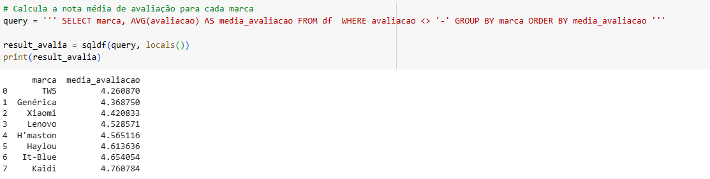

## **Web Scraping do Mercado Livre**

### **Scope of works**

Individual project demonstrating a Python web scraping workflow on
Mercado Livre, a Brazilian e‑commerce site.

Implemented in a Google Colab notebook, the project includes a Python
script that requests web pages, parses and extracts data, and outputs a
cleaned CSV file plus analysis delivered as reports and visualizations.

  

### **Libraries**

The script uses the BeautifulSoup library, which stores all HTML data in
an object called the \"soup\", the Requests library for making page
access requests to websites, and the Pandas and Matplotlib libraries.

  

The main purpose of the project is to run a Python script that makes a
request to the Mercado Livre website, performing a search for the
product wireless headphones ("fone de ouvido sem fio" in portuguese language).
After the request, the page is saved and several brands are parsed,
extracting data such as price, rating, brand name, and product
description. These data are saved in a CSV file. Running the Python
script also generates statistics about the selected brands and produces
charts.

To develop the script, an HTML study of the Mercado Livre site was
necessary. Inspecting the pages from which data are extracted identified
the tags and fields required to build the script. The product search URL
was saved in a variable to be used in the request process.

On the first page loaded after opening the URL, the first eight brands
were used. The script visits each brand and selects the first 50
products, which are then loaded on the next page.

  

### **Final Version of the Script**

 Note: the pages on this site are constantly changing. To run the code
below, you must verify that the page layout remains the same as
documented here by checking the pages HTML script.
---

Below is an explanation of how the script was developed.

It begins with importing libraries:

  

I defined two functions:

  

Above, I set a 2-second wait for the browser to load each page. 

Below, I created a for loop to iterate through the list (from the soup) of all
headphones that appear on the page after accessing a brand link.

  

Below is the configuration of the data to access the main page using
BeautifulSoup.

  

Then I extract the brands shown on the search results page.

  

Below, I use a for loop to read the list of brands (which is in the Soup). 
I store each brand’s link (and name) in a dictionary so I can access them later.

  

I save all headphone data into a dataframe and then export it to a CSV
file.

  

Partial preview of the file:

  

Below are the script and the generation of several reports containing
descriptive statistics of the data produced. I chose to use SQL instead
of the describe method as a challenge.

  

  

  

  

  

Below is a partial view of the report.

  

  

  

  

And last but not least, several charts were generated.

  

  

### **Conclusion**

This small project develops a Python script to extract market research
data from the Mercado Livre website using a method called web scraping.

Skills developed with this project:

- HTML script knowledge.

- Developing Python scripts in Google Coolab notebook.

- Python coding with Requests and BeautifulSoup to access web pages,
  save their contents and process them.

- Python coding with Pandas to store and manipulate dataframes and
  produce statistical reports.

- Python coding with Matplotlib to generate charts.
